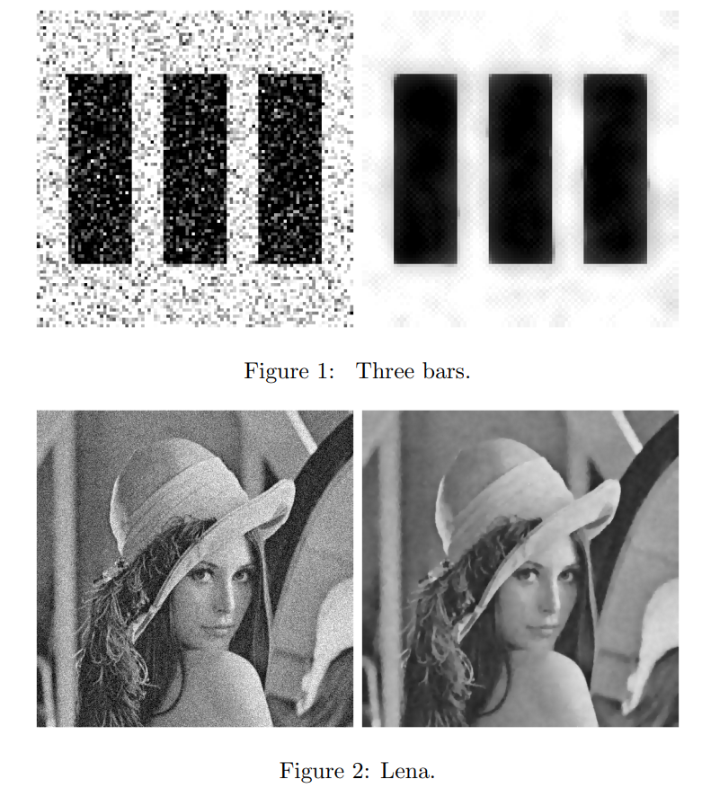

# ROF-Denoising

Implements image denoising as presented by Rudin, Osher and Fatemi in 1992. The paper discusses the mathematical formulation of the ROF model, an optimization problem with
a regularization term.

This problem can be solved by a partial differential equation, and `rof.m` translates this into a finite difference scheme.

  

